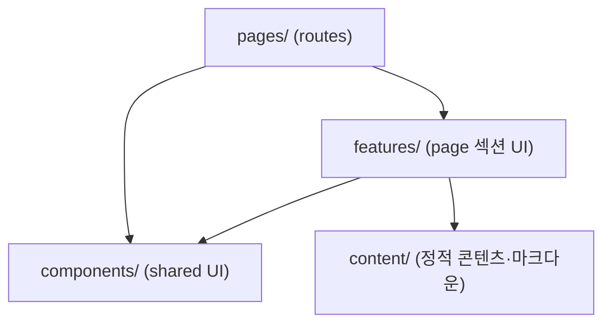

# Architecture

개인 소개(포트폴리오) 정적 사이트. 백엔드 없음, SPA(React Router).

## 폴더 역할

| 폴더 | 역할 |
|------|------|
| `pages/` | 라우트 단위 페이지 (`home`, `not-found`) |
| `features/` | 페이지를 구성하는 도메인 섹션 (`hero`, `about`, `projects`, `contact`) |
| `components/` | 재사용 공용 UI (`button`, `header`, `footer`) |
| `content/` | 소개 텍스트·프로젝트 데이터 등 정적 콘텐츠 (마크다운은 `react-markdown` 으로 렌더) |
| `store/` | Zustand 전역 상태 (`themeStore` 등) |
| `styles/` | 테마·전역 레이아웃·텍스트 헬퍼 |
| `hooks/` · `lib/` · `types/` | 커스텀 훅 · 유틸 · 공용 타입 |

## 폴더 파일 구성

각 컴포넌트 폴더: `index.ts` · `Component.tsx` · `.style.ts`(길 때) · `.type.ts`(Props)
